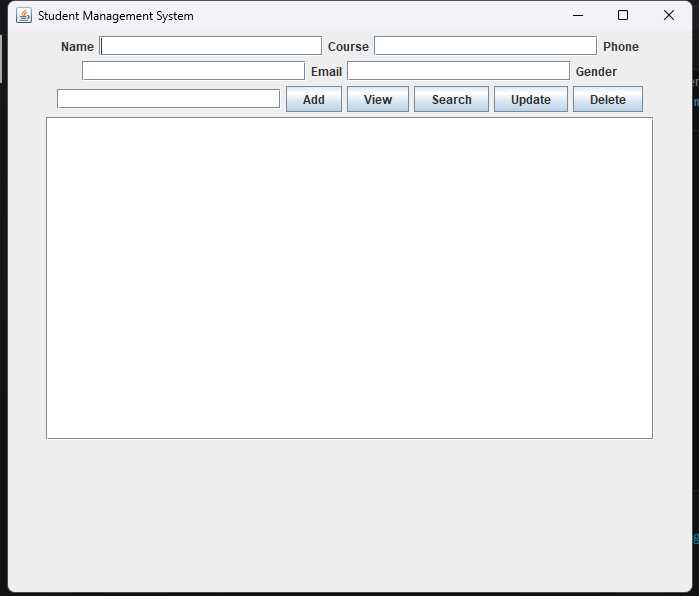
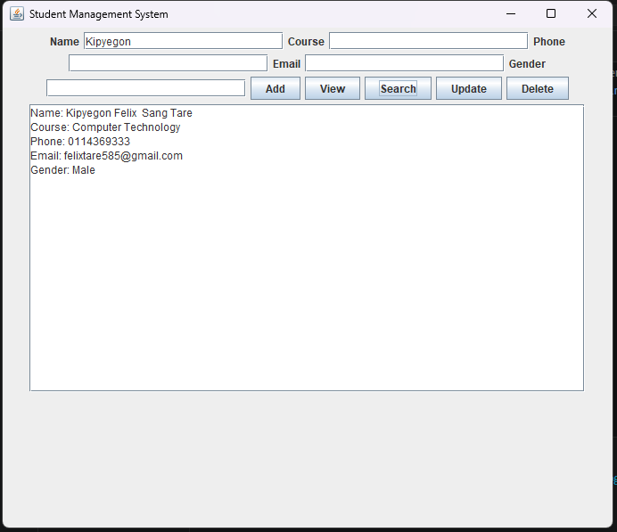
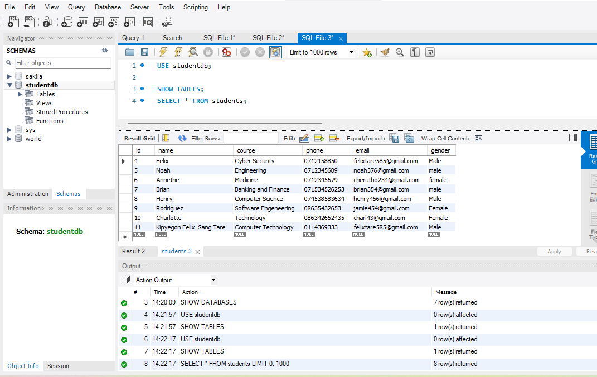

# 🎓 Student Management System


A Java Swing desktop application for managing student records with MySQL database integration.

---

## 📌 Overview

The Student Management System is a desktop-based application developed using Java Swing and JDBC.

It allows users to add, view, search, update, and delete student records through a graphical user interface while storing data in a MySQL database.

---

## 🚀 Features

✅ Add students  
✅ View student records  
✅ Search students  
✅ Update student information  
✅ Delete student records  
✅ MySQL database integration  
✅ User-friendly GUI interface  

---

## 🛠️ Technologies Used

- Java
- Java Swing
- MySQL
- JDBC
- Git & GitHub

---

## 📂 Project Structure

```text
src/
│
├── database/
│   └── DatabaseConnection.java
│
├── gui/
│   └── StudentManagementSystem.java
│
└── model/
    └── Student.java

lib/
│
└── mysql-connector-j.jar

screenshots/
│
├── home.png
├── add-student.png
└── database.png
```

---

## 📸 Screenshots

### 🏠 Home Page



### ➕ Add Student



### 🗄️ Database Connection



---

## 🗄️ Database

The application uses MySQL to store student records.

Database name:

```sql
student_management
```

The application connects to MySQL using JDBC.

---

## ▶️ How To Run

1. Install Java JDK
2. Start MySQL Server
3. Add MySQL Connector/J library
4. Update database credentials in the connection file
5. Run the application

---

## 📚 Requirements

- Java JDK 8 or higher
- MySQL Server
- MySQL Connector/J
- IDE (VS Code, IntelliJ IDEA, or Eclipse)

---

## 👨‍💻 Author

**Felix Tare**

GitHub:  
https://github.com/felixtare585-gif

---

⭐ If you like this project, consider giving it a star.